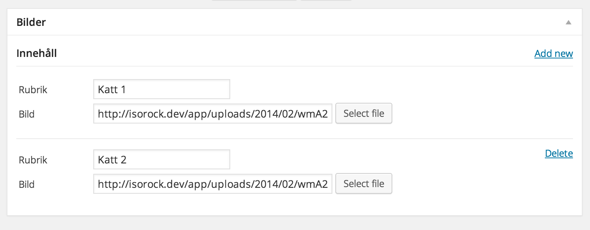
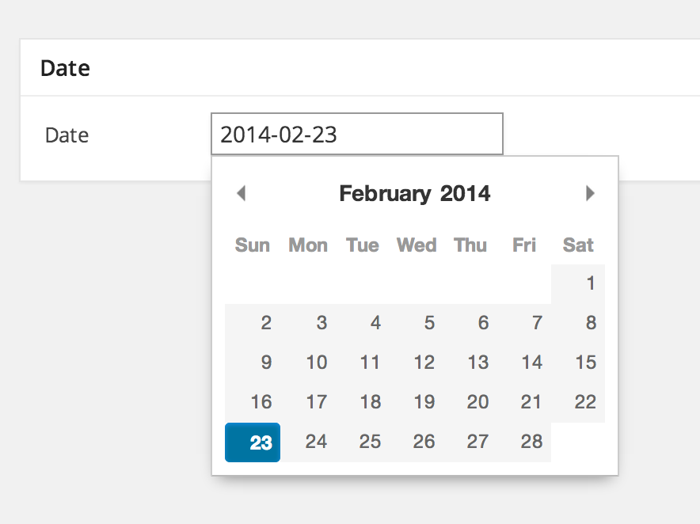
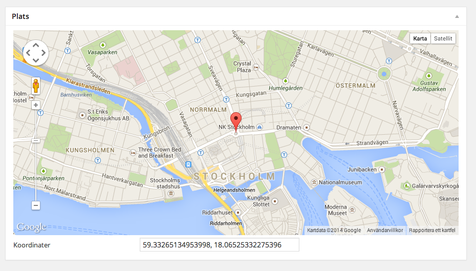

# Page Type Builder for WordPress

**Not ready for production yet**

### Example

The page type class.

```php

<?php

class PTB_Standard_Page extends PTB_Base {

	public static $page_type = array(
		'name' => 'Standard Page',
		'description' => 'Description of standard page',
		'template' => 'page-standard-page.php'
	);
	
	public function __construct () {
		parent::__construct();
		
        $this->box('Content', array(
          $this->property(array(
            'type' => 'PropertyString',
            'title' => 'Heading',
          )),
          $this->property(array(
            'type' => 'PropertyText',
            'title' => 'Text',
          ))
        ));
	}

}

```

#### Template

The page will store the value of `template` in `_wp_page_template` so right `page-{x}.php` is loaded in your theme.

#### Get value

```php
<?php

  echo current_page()->heading;
  
  // or
  echo ptb_value('heading');
  
```

## Screenshots

#### Collection with Property String and Property Url



#### Property Date with Pikaday date picker.



#### Property Map



## Trello
[https://trello.com/b/SphdReVr/page-type-builder-for-wordpress](https://trello.com/b/SphdReVr/page-type-builder-for-wordpress)
